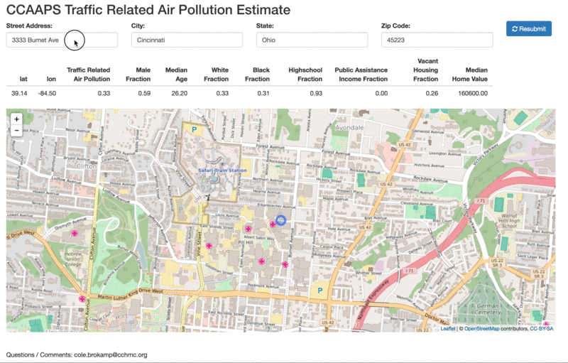

 <h1>geocore.io</h1> 

&nbsp; 

 

<h4>Cincinnati Neighborhoods</h4>

[geocore.io/neighborhood](http://ecat-map.amazon-shiny.duckdns.org)

 

 

&nbsp; 

<h4>Individual Dashboard</h4>

[geocore.io/individual](http://ecat-map.amazon-shiny.duckdns.org)

 

